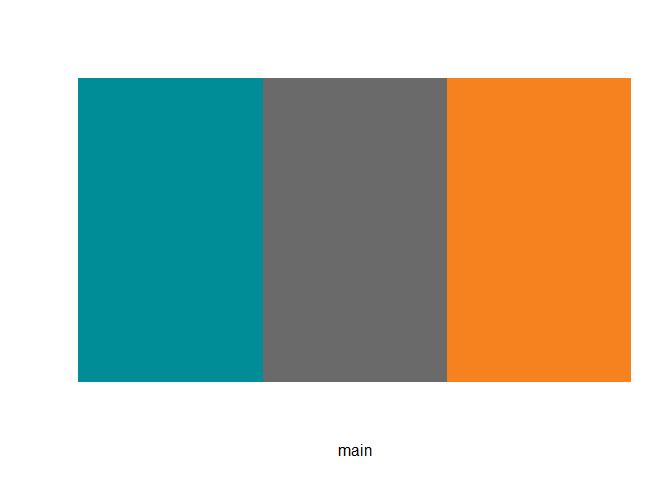
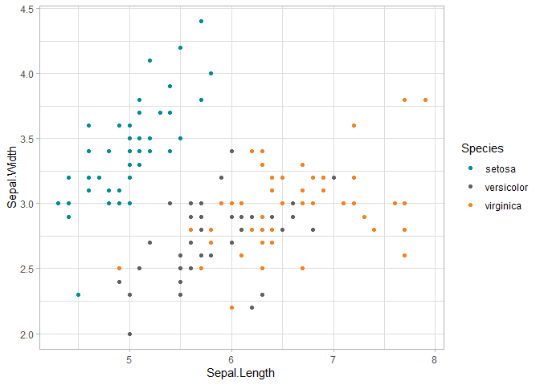
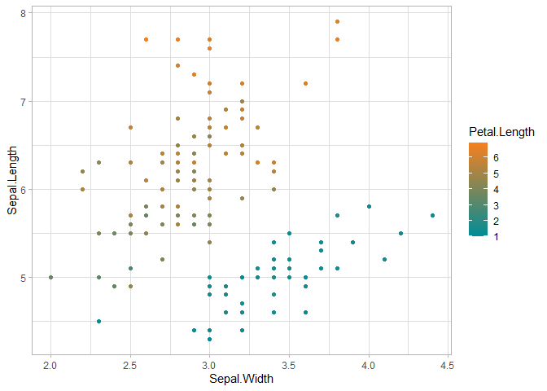

<!-- README.md is generated from README.Rmd. Please edit that file -->

# hurwitzLab

<!-- badges: start -->
<!-- badges: end -->

In Hurwitz Lab, we take pride in conveying information with elegant
figures. We also like a level of consistency in the work produced by our
group. This package provide color palettes and themes to be used when
producing figures in R.

## Installation

You can install hurwitzLab with:

``` r
devtools::install_github("schackartk/hurwitzLab")
```

## What’s here?

This package currently provides color palettes for Hurwitz Lab.

### Available Color Palettes

The following palettes are available: main, classic, gray

Palettes can be previewed using the `display_hurwitz_pal()` function:

``` r
library(hurwitzLab)

display_hurwitz_pal(3, "main")
```



## Examples

Usage is similar to other palette packages. Functions are available for
both scale\_fill and scale\_color.

``` r
library(hurwitzLab)
library(ggplot2)

ggplot(iris, aes(x = Sepal.Length, y = Sepal.Width, color = Species)) +
  geom_point() +
  theme_light() +
  hurwitzLab::scale_color_hurwitz()
```



Palettes can be used for continuous variables too:

``` r
library(hurwitzLab)
library(ggplot2)

ggplot(iris, aes(x = Sepal.Width, y = Sepal.Length, color = Petal.Length)) +
  geom_point() +
  theme_light() +
  scale_color_hurwitz(discrete = FALSE, palette = "classic")
```


