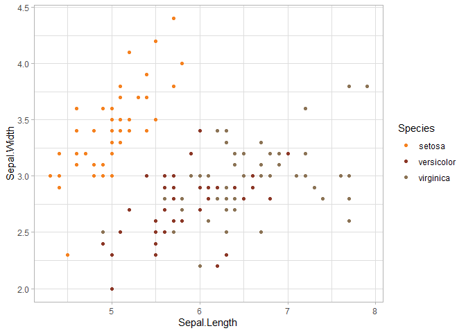

<!-- README.md is generated from README.Rmd. Please edit that file -->

# hurwitzLab

<!-- badges: start -->
<!-- badges: end -->

In Hurwitz Lab, we take pride in conveying information with elegant
figures. We also like a level of consistency in the work produced by our
group. This package provide color palettes and themes to be used when
producing figures in R.

## Installation

You can install hurwitzLab with:

``` r
devtools::install_github("schackartk/hurwitzLab")
```

## What’s here?

This package currently provides color palettes for Hurwitz Lab.

Here are all colors:

<style>html {
  font-family: -apple-system, BlinkMacSystemFont, 'Segoe UI', Roboto, Oxygen, Ubuntu, Cantarell, 'Helvetica Neue', 'Fira Sans', 'Droid Sans', Arial, sans-serif;
}

#vtvgtmnjzb .gt_table {
  display: table;
  border-collapse: collapse;
  margin-left: auto;
  margin-right: auto;
  color: #333333;
  font-size: 16px;
  font-weight: normal;
  font-style: normal;
  background-color: #FFFFFF;
  width: auto;
  border-top-style: solid;
  border-top-width: 2px;
  border-top-color: #A8A8A8;
  border-right-style: none;
  border-right-width: 2px;
  border-right-color: #D3D3D3;
  border-bottom-style: solid;
  border-bottom-width: 2px;
  border-bottom-color: #A8A8A8;
  border-left-style: none;
  border-left-width: 2px;
  border-left-color: #D3D3D3;
}

#vtvgtmnjzb .gt_heading {
  background-color: #FFFFFF;
  text-align: center;
  border-bottom-color: #FFFFFF;
  border-left-style: none;
  border-left-width: 1px;
  border-left-color: #D3D3D3;
  border-right-style: none;
  border-right-width: 1px;
  border-right-color: #D3D3D3;
}

#vtvgtmnjzb .gt_title {
  color: #333333;
  font-size: 125%;
  font-weight: initial;
  padding-top: 4px;
  padding-bottom: 4px;
  border-bottom-color: #FFFFFF;
  border-bottom-width: 0;
}

#vtvgtmnjzb .gt_subtitle {
  color: #333333;
  font-size: 85%;
  font-weight: initial;
  padding-top: 0;
  padding-bottom: 4px;
  border-top-color: #FFFFFF;
  border-top-width: 0;
}

#vtvgtmnjzb .gt_bottom_border {
  border-bottom-style: solid;
  border-bottom-width: 2px;
  border-bottom-color: #D3D3D3;
}

#vtvgtmnjzb .gt_col_headings {
  border-top-style: solid;
  border-top-width: 2px;
  border-top-color: #D3D3D3;
  border-bottom-style: solid;
  border-bottom-width: 2px;
  border-bottom-color: #D3D3D3;
  border-left-style: none;
  border-left-width: 1px;
  border-left-color: #D3D3D3;
  border-right-style: none;
  border-right-width: 1px;
  border-right-color: #D3D3D3;
}

#vtvgtmnjzb .gt_col_heading {
  color: #333333;
  background-color: #FFFFFF;
  font-size: 100%;
  font-weight: normal;
  text-transform: inherit;
  border-left-style: none;
  border-left-width: 1px;
  border-left-color: #D3D3D3;
  border-right-style: none;
  border-right-width: 1px;
  border-right-color: #D3D3D3;
  vertical-align: bottom;
  padding-top: 5px;
  padding-bottom: 6px;
  padding-left: 5px;
  padding-right: 5px;
  overflow-x: hidden;
}

#vtvgtmnjzb .gt_column_spanner_outer {
  color: #333333;
  background-color: #FFFFFF;
  font-size: 100%;
  font-weight: normal;
  text-transform: inherit;
  padding-top: 0;
  padding-bottom: 0;
  padding-left: 4px;
  padding-right: 4px;
}

#vtvgtmnjzb .gt_column_spanner_outer:first-child {
  padding-left: 0;
}

#vtvgtmnjzb .gt_column_spanner_outer:last-child {
  padding-right: 0;
}

#vtvgtmnjzb .gt_column_spanner {
  border-bottom-style: solid;
  border-bottom-width: 2px;
  border-bottom-color: #D3D3D3;
  vertical-align: bottom;
  padding-top: 5px;
  padding-bottom: 6px;
  overflow-x: hidden;
  display: inline-block;
  width: 100%;
}

#vtvgtmnjzb .gt_group_heading {
  padding: 8px;
  color: #333333;
  background-color: #FFFFFF;
  font-size: 100%;
  font-weight: initial;
  text-transform: inherit;
  border-top-style: solid;
  border-top-width: 2px;
  border-top-color: #D3D3D3;
  border-bottom-style: solid;
  border-bottom-width: 2px;
  border-bottom-color: #D3D3D3;
  border-left-style: none;
  border-left-width: 1px;
  border-left-color: #D3D3D3;
  border-right-style: none;
  border-right-width: 1px;
  border-right-color: #D3D3D3;
  vertical-align: middle;
}

#vtvgtmnjzb .gt_empty_group_heading {
  padding: 0.5px;
  color: #333333;
  background-color: #FFFFFF;
  font-size: 100%;
  font-weight: initial;
  border-top-style: solid;
  border-top-width: 2px;
  border-top-color: #D3D3D3;
  border-bottom-style: solid;
  border-bottom-width: 2px;
  border-bottom-color: #D3D3D3;
  vertical-align: middle;
}

#vtvgtmnjzb .gt_from_md > :first-child {
  margin-top: 0;
}

#vtvgtmnjzb .gt_from_md > :last-child {
  margin-bottom: 0;
}

#vtvgtmnjzb .gt_row {
  padding-top: 8px;
  padding-bottom: 8px;
  padding-left: 5px;
  padding-right: 5px;
  margin: 10px;
  border-top-style: solid;
  border-top-width: 1px;
  border-top-color: #D3D3D3;
  border-left-style: none;
  border-left-width: 1px;
  border-left-color: #D3D3D3;
  border-right-style: none;
  border-right-width: 1px;
  border-right-color: #D3D3D3;
  vertical-align: middle;
  overflow-x: hidden;
}

#vtvgtmnjzb .gt_stub {
  color: #333333;
  background-color: #FFFFFF;
  font-size: 100%;
  font-weight: initial;
  text-transform: inherit;
  border-right-style: solid;
  border-right-width: 2px;
  border-right-color: #D3D3D3;
  padding-left: 12px;
}

#vtvgtmnjzb .gt_summary_row {
  color: #333333;
  background-color: #FFFFFF;
  text-transform: inherit;
  padding-top: 8px;
  padding-bottom: 8px;
  padding-left: 5px;
  padding-right: 5px;
}

#vtvgtmnjzb .gt_first_summary_row {
  padding-top: 8px;
  padding-bottom: 8px;
  padding-left: 5px;
  padding-right: 5px;
  border-top-style: solid;
  border-top-width: 2px;
  border-top-color: #D3D3D3;
}

#vtvgtmnjzb .gt_grand_summary_row {
  color: #333333;
  background-color: #FFFFFF;
  text-transform: inherit;
  padding-top: 8px;
  padding-bottom: 8px;
  padding-left: 5px;
  padding-right: 5px;
}

#vtvgtmnjzb .gt_first_grand_summary_row {
  padding-top: 8px;
  padding-bottom: 8px;
  padding-left: 5px;
  padding-right: 5px;
  border-top-style: double;
  border-top-width: 6px;
  border-top-color: #D3D3D3;
}

#vtvgtmnjzb .gt_striped {
  background-color: rgba(128, 128, 128, 0.05);
}

#vtvgtmnjzb .gt_table_body {
  border-top-style: solid;
  border-top-width: 2px;
  border-top-color: #D3D3D3;
  border-bottom-style: solid;
  border-bottom-width: 2px;
  border-bottom-color: #D3D3D3;
}

#vtvgtmnjzb .gt_footnotes {
  color: #333333;
  background-color: #FFFFFF;
  border-bottom-style: none;
  border-bottom-width: 2px;
  border-bottom-color: #D3D3D3;
  border-left-style: none;
  border-left-width: 2px;
  border-left-color: #D3D3D3;
  border-right-style: none;
  border-right-width: 2px;
  border-right-color: #D3D3D3;
}

#vtvgtmnjzb .gt_footnote {
  margin: 0px;
  font-size: 90%;
  padding: 4px;
}

#vtvgtmnjzb .gt_sourcenotes {
  color: #333333;
  background-color: #FFFFFF;
  border-bottom-style: none;
  border-bottom-width: 2px;
  border-bottom-color: #D3D3D3;
  border-left-style: none;
  border-left-width: 2px;
  border-left-color: #D3D3D3;
  border-right-style: none;
  border-right-width: 2px;
  border-right-color: #D3D3D3;
}

#vtvgtmnjzb .gt_sourcenote {
  font-size: 90%;
  padding: 4px;
}

#vtvgtmnjzb .gt_left {
  text-align: left;
}

#vtvgtmnjzb .gt_center {
  text-align: center;
}

#vtvgtmnjzb .gt_right {
  text-align: right;
  font-variant-numeric: tabular-nums;
}

#vtvgtmnjzb .gt_font_normal {
  font-weight: normal;
}

#vtvgtmnjzb .gt_font_bold {
  font-weight: bold;
}

#vtvgtmnjzb .gt_font_italic {
  font-style: italic;
}

#vtvgtmnjzb .gt_super {
  font-size: 65%;
}

#vtvgtmnjzb .gt_footnote_marks {
  font-style: italic;
  font-size: 65%;
}
</style>
<div id="vtvgtmnjzb" style="overflow-x:auto;overflow-y:auto;width:auto;height:auto;"><table class="gt_table">
  <thead class="gt_header">
    <tr>
      <th colspan="2" class="gt_heading gt_title gt_font_normal" style>hurwitzLab colors</th>
    </tr>
    <tr>
      <th colspan="2" class="gt_heading gt_subtitle gt_font_normal gt_bottom_border" style></th>
    </tr>
  </thead>
  <thead class="gt_col_headings">
    <tr>
      <th class="gt_col_heading gt_columns_bottom_border gt_left" rowspan="1" colspan="1">Name</th>
      <th class="gt_col_heading gt_columns_bottom_border gt_left" rowspan="1" colspan="1">Color</th>
    </tr>
  </thead>
  <tbody class="gt_table_body">
    <tr>
      <td class="gt_row gt_left">orange</td>
      <td class="gt_row gt_left" style="background-color: #F5811F; color: #000000;">#F5811F</td>
    </tr>
    <tr>
      <td class="gt_row gt_left">teal</td>
      <td class="gt_row gt_left" style="background-color: #018D97; color: #FFFFFF;">#018D97</td>
    </tr>
    <tr>
      <td class="gt_row gt_left">gold</td>
      <td class="gt_row gt_left" style="background-color: #FFD900; color: #000000;">#FFD900</td>
    </tr>
    <tr>
      <td class="gt_row gt_left">viking</td>
      <td class="gt_row gt_left" style="background-color: #61CDDC; color: #000000;">#61CDDC</td>
    </tr>
    <tr>
      <td class="gt_row gt_left">dark_gray</td>
      <td class="gt_row gt_left" style="background-color: #6A6A6A; color: #FFFFFF;">#6A6A6A</td>
    </tr>
    <tr>
      <td class="gt_row gt_left">red</td>
      <td class="gt_row gt_left" style="background-color: #8B3726; color: #FFFFFF;">#8B3726</td>
    </tr>
    <tr>
      <td class="gt_row gt_left">tan</td>
      <td class="gt_row gt_left" style="background-color: #D2B48C; color: #000000;">#D2B48C</td>
    </tr>
    <tr>
      <td class="gt_row gt_left">cyan</td>
      <td class="gt_row gt_left" style="background-color: #97FFFF; color: #000000;">#97FFFF</td>
    </tr>
    <tr>
      <td class="gt_row gt_left">charcoal</td>
      <td class="gt_row gt_left" style="background-color: #333333; color: #FFFFFF;">#333333</td>
    </tr>
    <tr>
      <td class="gt_row gt_left">light_gray</td>
      <td class="gt_row gt_left" style="background-color: #CCCCCC; color: #000000;">#CCCCCC</td>
    </tr>
    <tr>
      <td class="gt_row gt_left">brown</td>
      <td class="gt_row gt_left" style="background-color: #8B7355; color: #FFFFFF;">#8B7355</td>
    </tr>
  </tbody>
  
  
</table></div>

### Available Color Palettes

The following palettes are available: main, classic, gray

Palettes can be previewed using the `display_hurwitz_pal()` function:

``` r
library(hurwitzLab)

display_hurwitz_pal("main", 3)
```


## Examples

Usage is similar to other palette packages. Functions are available for
both scale\_fill and scale\_color.

``` r
library(hurwitzLab)
library(ggplot2)

ggplot(iris, aes(x = Sepal.Length, y = Sepal.Width, color = Species)) +
  geom_point() +
  theme_light() +
  hurwitzLab::scale_color_hurwitz()
```



Palettes can be used for continuous variables too:

``` r
library(hurwitzLab)
library(ggplot2)

ggplot(iris, aes(x = Sepal.Width, y = Sepal.Length, color = Petal.Length)) +
  geom_point() +
  theme_light() +
  scale_color_hurwitz(discrete = FALSE, palette = "classic")
```


